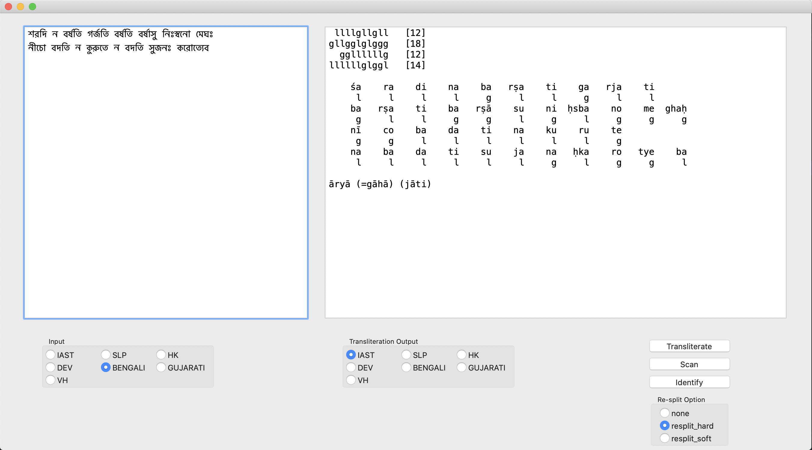
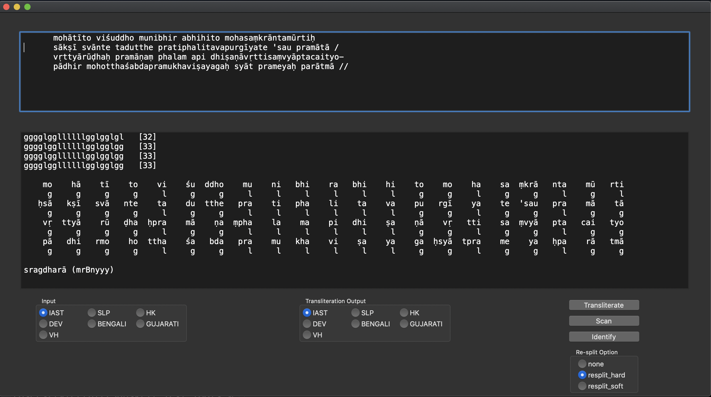

# Skrutable

The Skrutable library is meant to make Sanskrit text processing less “inscrutible”, both for interested laypeople and for serious students and scholars, especially those who know a bit of Python and are curious to peek under the hood.

# Features

* Four main functionalities
	* scheme detection (frequency-based for robustness) [still under development]
	* transliteration (extensible)
	* scansion (with aligned output)
	* meter identification (extensible, with semiautomatic pāda re-splitting)

* Three use options

	* Python library (modular; consistent object-based syntax; readable code)

	* Python command-line interface [still under development]

	* Desktop GUI (wxpython-based; currently macOS only; requires additional setup)
		
		

	* (And hopefully a fourth option one day soon: web-based version of the GUI)

* User settings all in one place (`config.json`), including
	* default scheme choices (incl. auto-detection)
	* virāma avoidance behavior (esp. for transliteration to Indic schemes)
	* default auto-resplit options for meter identification

# Getting Started

1. Have Python 3 installed. (Homebrew recommended)

2. Install Skrutable.

* (Eventually: Installation via pip. For now...)

* [Download this repo](https://github.com/tylergneill/skrutable/archive/master.zip). (same as green “Code” button on [GitHub main page](https://github.com/tylergneill/skrutable))

* Put the Skrutable folder where your other Python libraries are.
	* Using virtualenv? You can put it directly in the relevant `lib/python3.x/site-packages` folder.
	* Not? Then you can put it where your other packages normally install to (e.g. with pip).
		* (Hint: command line `python -c "import sys; print(sys.path)"` to see where.)

3. Get the necessary Python libraries.

* If you'll just be using the library, then only numpy may be necessary to install. (pip recommended)

* If you wish to use the desktop GUI, then also install wxpython (includes numpy, setuptools) and py2app.

* (Should already be natively pre-installed: collections, copy, json, operator, os, re)

For GUI setup, see [Getting the Desktop GUI to Work](#getting-the-desktop-gui-to-work) below.

# Using the Python Library

Import modules, instantiate their respective objects, and use those objects' primary methods.

(Note for coding purposes: lowercase for “skrutable” and all modules, camelcase for objects.)

1. Scheme Detection
	* `from skrutable.scheme_detection import SchemeDetector`
	* `SD = SchemeDetector()`
	* `string_result = SD.detect_scheme( input_string )`

2. Transliteration
	* `from skrutable.transliteration import Transliterator`
	* `T = Transliterator()`
	* `string_result = T.transliterate( input_string ) # using defaults`
	* `another_string_result = T.transliterate( input_string, to_scheme='BENGALI' )`

3. Scansion
	* `from skrutable.scansion import Scanner`
	* `S = Scanner()`
	* `object_result = S.scan( input_string )`
	* `print( object_result.summarize() )`

4. Meter Identification
	* `from skrutable.meter_identification import MeterIdentifier`
	* `MI = MeterIdentifier()`
	* `object_result = MI.identify_meter( input_string ) # default resplit_option`
	* `print( object_result.summarize() )`
	* `another_object_result = MI.identify_meter(input_string, resplit_option='resplit_hard')`
	* `print( another_object_result.meter_label() )`

For more examples, see `demo.py`.

# Using the Command Line Interface

You can also issue certain simple requests on the command line. Examples:
1. Transliterate to Bengali script: `python skrutable.py --transliterate FILENAME.txt to_scheme=BENGALI`
2. Identify the meter of a verse: `python skrutable.py --identify_meter FILENAME.txt`

For more, see `skrutable.py`.

# Schemes

(Note: “Encoding” here means basically UTF-8, and “script” means a distinct character set (e.g. Roman alphabet vs. Devanagari alphabet/syllabary/abugida). Thus, neither “Roman” nor “Unicode” are used here to refer to the “(transliteration) schemes” described below. For more on such terminology, see [here](http://indology.info/email/members/wujastyk/) and [here](http://sanskritlibrary.org/Sanskrit/pub/lies_sl.pdf).)

The schemes used in Skrutable are all referred internally to by simple strings, namely, the abbreviations in the following table:

<table>
    <thead>
        <tr>
            <th>Scheme Type</th>
            <th>Scheme Abbreviation</th>
            <th>Scheme Full Name</th>
            <th>Example</th>
        </tr>
    </thead>
    <tbody>
        <tr>
            <td rowspan=8>Roman</td>
            <td>IAST</td>
            <td>International Alphabet of Sanskrit Transliteration</td>
            <td>paṭhāmaḥ</td>
        </tr>
        <tr>
            <td>SLP</td>
            <td>Sanskrit Library Protocol 1</td>
            <td>paWAmaH</td>
        </tr>
        <tr>
            <td>HK</td>
            <td>Harvard-Kyoto</td>
            <td>paThAmaH</td>
        </tr>
        <tr>
            <td>VH</td>
            <td>Velthuis</td>
            <td>pa.thaama.h</td>
        </tr>
        <tr>
            <td>WX</td>
            <td>Scheme developed at IIT Kanpur</td>
            <td>paTAmaH</td>
        </tr>
        <tr>
            <td>ITRANS</td>
            <td>Indian Languages Transliteration</td>
            <td>paThaamaH</td>
        </tr>
        <tr>
            <td>CSX</td>
            <td>Classical Sanskrit eXtended</td>
            <td>paòâmaþ</td>
        </tr>
        <tr>
            <td>REE</td>
            <td>Scheme used by Ronald E. Emmerick</td>
            <td>paèÃma÷</td>
        </tr>
        <tr>
            <td rowspan=3>Indic</td>
            <td>DEV</td>
            <td>Devanagari Unicode</td>
            <td>पठामः</td>
        </tr>
        <tr>
            <td>BENGALI</td>
            <td>Bengali Unicode</td>
            <td>পঠামঃ</td>
        </tr>
        <tr>
            <td>GUJARATI</td>
            <td>Gujarati Unicode</td>
            <td>પઠામઃ</td>
        </tr>
    </tbody>
</table>

Skrutable can be extended to include more such simple Roman- or Brāhmi-based schemes for Classical Sanskrit and perhaps even related classical languages like Vedic or Prakrits (specifically, by modifying the modules `phonemes.py` and `scheme_maps.py`). On the other hand, it is not designed for modern languages with phonologies that differ significantly from Sanskrit (such as Hindi, Tamil, and so on). For tools made for such languages, cp. [Related Sanskrit Transliteration and Scansion Projects](#related-sanskrit-transliteration-and-scansion-projects) below.

Note also that scheme auto-detection can be useful whenever manually specifying the input scheme might be inconvenient, but that this should be used with caution, since this feature in Skrutable works based on input character frequencies, and so results will deteriorate the shorter and/or messier the input string becomes.

# Virāma (and Whitespace) Avoidance

Sometimes, usually for aesthetic purposes (read: only rarely for scientific ones), it is best to suppress extra virāmas and spaces between words, such as where Indic scripts would instead feature ligatures. For example:

~~~
“asty eva” >> (“अस्त्य् एव”) >> “अस्त्येव”
~~~

For such cases, the skrutable.transliteration module includes a simple but handy “virāma avoidance” feature, based on straightforward regular expressions and string replacements, which eliminates spaces (and with them virāmas) between certain specified combinations of characters. Settings for this can be controlled in `config.py` and `virAma_avoidance.py`.

# Encoding Normalization

Some schemes have internal encoding options. For example, IAST is sometimes stored with combining diacritics, sometimes with precomposed combinations. Round-trip transliteration in Skrutable can be used to iron out such differences. For example, with IAST-IAST transliteration (yes, you can do that):

~~~
"rāmaḥ" == 'r' + 'a' + '¯' chr(0x0304) + 'm' + 'a' + 'h' + '.' chr(0x0323)
>>
"rāmaḥ" == 'r' + 'ā' + chr(0x0101) + 'm' + 'a' + 'ḥ' chr(0x1e25)
~~~

Default behavior favors precomposed characters in IAST and certain, somewhat arbitrary choices for other schemes, as well; see and control details in `scheme_maps.py`.

# Sandhi and Compound Segmentation

For automated sandhi and compound segmentation, which is a much, much harder problem but whose results can still comfortable be represented in plain-text, Skrutable defers to the Hellwig-Nehrdich pre-trained neural-network tool, [Sanskrit Sandhi and Compound Splitter](https://github.com/OliverHellwig/sanskrit/tree/master/papers/2018emnlp), which produces good, usable results. (TensorFlow required)

# Related Sanskrit Transliteration and Scansion Projects

Numerous other projects exist which some users may find preferable to Skrutable in certain respects (e.g., more script support, easier to install, nicer looking, available online). Here are my recommended highlights.

Scheme Detection | Transliteration | Scansion & Meter Identification | Main Author
-------- | ---------- | --------- | --------
([“detect.py” module](https://github.com/sanskrit/detect.py)) | **[Sanscript](http://learnsanskrit.org/tools/sanscript)** (also via PyPi [here](https://github.com/sanskrit-coders/indic_transliteration)) | (n/a) | Arun Prasad
(n/a) | **[Aksharamukha](http://aksharamukha.appspot.com/converter)** | (n/a) | Vinodh Rajan
([“detect.py” module](https://github.com/shreevatsa/sanskrit/blob/master/transliteration/detect.py)) | ([“transliteration” subpackage](https://github.com/shreevatsa/sanskrit/tree/master/transliteration)) | **[Metre Identifier](http://sanskritmetres.appspot.com/)** | Shreevatsa R.
(n/a) | (n/a) | **[Meter Identifying Tool](http://sanskritlibrary.org:8080/MeterIdentification/)** | Keshav Melnad
(n/a) | **[Transliteration Tool](https://www.ashtangayoga.info/philosophy/sanskrit-and-devanagari/transliteration-tool/)** | (n/a) | AshtangaYoga.info
(n/a) | [Sanscription](http://www.tyfen.com/sanscription/) | (n/a) | Marc Tiefenauer

# Getting the desktop GUI to work

The desktop GUI app is made with wxpython and py2app, and I'm so far having trouble compiling a working standalone binary that others can also use. However, py2app also has an “alias” mode which also produces a working app, and I've seen the [same procedure I used](https://py2app.readthedocs.io/en/latest/tutorial.html) work on a Mac other than my own. Try the following:
* Have the required libraries installed (see [Getting Started](#getting-started) above).
* In the Skrutable folder, create a setup.py file based on the GUI module: `py2applet --make-setup gui.py`
* Build the application in alias mode: `python setup.py py2app -A`
* (Optional:) Rename and move the resulting alias-mode app to Applications: `mv /PATH/TO/skrutable/dist/gui.app /Applications/Skrutable.app`

If all goes well, you should now be able to run the Skrutable GUI as you would any other app on macOS, for example via Spotlight. I haven't yet tried this for Windows, but py2exe should produce similar results.

# Web App

Calling all volunteers! Like Skrutable? Know some web programming? I sure don't. Help me build a simple web front-end!