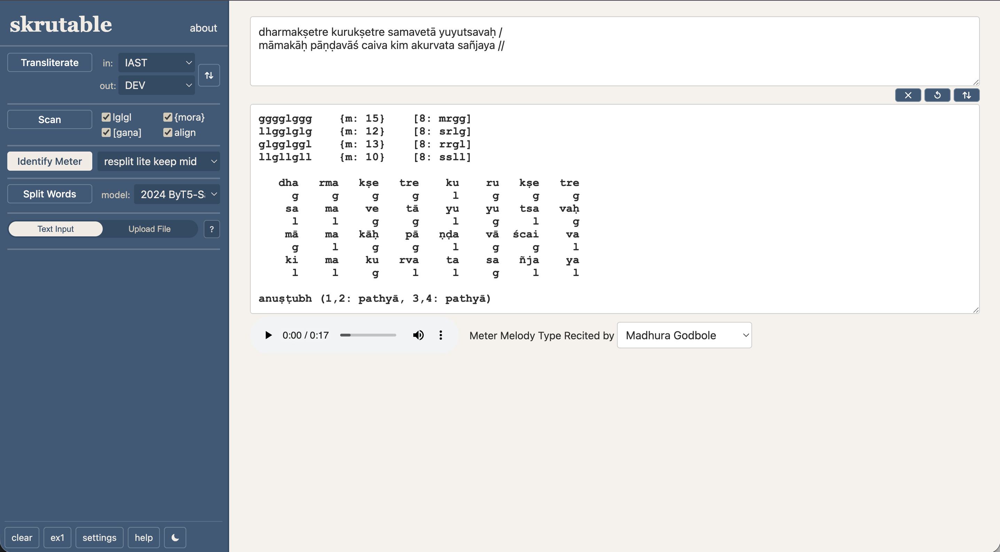

# about

`skrutable` is a Python library and online workbench for working with Sanskrit text: transliteration, scansion, and meter identification, as well as access to powerful sandhi and compound splitting.

For more context, see [skrutable.info/about](https://www.skrutable.info/about)

# how to use

The online web app at [skrutable.info](https://www.skrutable.info/) provides easy access to both one-off and whole-file processing.

See [skrutable.info/help](https://www.skrutable.info/help) for more instructions.

For Python programmers, `skrutable` is also importable as a library. Just `pip install skrutable` and see [below](#using-the-code).

Programmers in any language can also query API endpoints. See [below](#using-the-api).

# transliteration

## schemes

Sanskrit can be written in many ways. The schemes featured in `skrutable` are:

<table>
    <thead>
        <tr>
            <th>Scheme Type</th>
            <th>Scheme Abbreviation</th>
            <th>Scheme Full Name</th>
            <th>Example</th>
        </tr>
    </thead>
    <tbody>
        <tr>
            <td rowspan=6>Roman</td>
            <td>IAST</td>
            <td>International Alphabet of Sanskrit Transliteration</td>
            <td>saṃskṛtaṃ paṭhāmaḥ</td>
        </tr>
        <tr>
            <td>HK</td>
            <td>Harvard-Kyoto</td>
            <td>saMskRtaM paThAmaH</td>
        </tr>
        <tr>
            <td>SLP</td>
            <td>Sanskrit Library Protocol 1</td>
            <td>saMskftaM paWAmaH</td>
        </tr>
        <tr>
            <td>ITRANS</td>
            <td>Indian Languages Transliteration</td>
            <td>sa.mskRita.m paThaama.h</td>
        </tr>
        <tr>
            <td>VH</td>
            <td>Velthuis</td>
            <td>sa.msk.rta.m pa.Taama.h</td>
        </tr>
        <tr>
            <td>WX</td>
            <td>Scheme developed at IIT Kanpur</td>
            <td>saMskqwaM paTAmaH</td>
        </tr>
        <tr>
            <td rowspan=3>Indic</td>
            <td>DEV</td>
            <td>Devanagari Unicode</td>
            <td>संस्कृतं पठामः</td>
        </tr>
        <tr>
            <td>BENGALI</td>
            <td>Bengali Unicode</td>
            <td>সংস্কৃতং পঠামঃ</td>
        </tr>
        <tr>
            <td>GUJARATI</td>
            <td>Gujarati Unicode</td>
            <td>સંસ્કૃતં પઠામઃ</td>
        </tr>
    </tbody>
</table>

There is also a lossy "IASTreduced" output option (e.g., "samskrtam pathamah") which can be useful in some contexts. Additional academic schemes not currently featured include CSX (Classical Sanskrit eXtended, e.g. "saüskçtaü paòâmaþ") and REE (by Ronald E. Emmerick, e.g. "saæsk­taæ paèÃma÷"). More schemes, especially for additional Indic scripts, can be added by modifying `phonemes.py` and `scheme_maps.py`. For tools with wider script support or coverage of other South Asian languages, see [related projects](#related-projects).

Terminology note: I say "scheme" as a generic term for different ways of writing Sanskrit. I use "encoding" only to refer to subtleties of UTF-8 Romanization and "script" in the sense of a distinct character set (e.g. Roman vs. Devanagari). I use neither "Roman" nor "Unicode" to refer to individual schemes. For other perspectives, see [here](http://indology.info/email/members/wujastyk/) and [here](http://sanskritlibrary.org/Sanskrit/pub/lies_sl.pdf).

## scheme detection

`skrutable` is able to automatically detect the input scheme in a robust way.

The algorithm involves three steps: 1. Indic-character ratios; 2. sample text compared against Mahābhārata reference vectors, with impossible-bigram penalties; and 3. priority tiebreakers. Accuracy is lowest with short inputs in Roman ASCII schemes (HK, ITRANS, SLP, VH).

## encoding normalization

Some schemes have internal variation. For example, IAST can be encoded with combining diacritics or precomposed characters, and ITRANS writes vocalic ṛ as 'Ri', 'RRi', or 'R^i'. Round-trip transliteration (e.g., IAST→IAST) normalizes such variation:

~~~
"rāmaḥ" == 'r' + 'a' + '¯' (U+0304) + 'm' + 'a' + 'h' + '.' (U+0323)
>>
"rāmaḥ" == 'r' + 'ā' (U+0101) + 'm' + 'a' + 'ḥ' (U+1E25)
~~~

`skrutable` favors precomposed characters for IAST. Scheme-internal defaults can be inspected and changed in `scheme_maps.py`.

## virāma avoidance

When transliterating to Indic scripts, `skrutable` by default removes inter-word virāmas and uses ligatures instead, which is generally preferred for print:

~~~
asty eva >> ( अस्त्य् एव ) >> अस्त्येव
~~~

This can be toggled with the `avoid_virama_indic_scripts` parameter. Similarly, `avoid_virama_non_indic_scripts` does the same for Roman schemes. The governing regular expressions are in `virAma_avoidance.py`.

# scansion and meter identification

For the concepts and traditional conventions in Sanskrit prosody on which `skrutable`'s meter functionality is based, see the appendix of V.S. Apte's *Practical Sanskrit-English dictionary*, 1890, pp. 1179ff. ([on Archive](https://archive.org/details/ldpd_7285627_000/page/n1195/mode/2up))

Key terms:
* *laghu* (l) / *guru* (g): metrically light / heavy syllable
* mora: value of 1 for each light syllable, 2 for each heavy syllable
* *gaṇa*: [traditional abbreviation](https://en.wikipedia.org/wiki/Sanskrit_prosody#Ga%E1%B9%87a) — ya ma ta ra ja bha na sa (la ga) — for each [trisyllable (or monosyllable) group](https://en.wikipedia.org/wiki/Foot_(prosody))
* *anuṣṭubh* (also *śloka*): 8 syllables per quarter (*pāda*) in a partly constrained, partly fluid *laghu-guru* pattern
* *samavṛtta*: four quarters with equal syllable count and a generally rigid *laghu-guru* pattern
* *jāti*: four quarters with set patterns of total moraic length

# sandhi and compound splitting

`skrutable` provides a wrapper for applying pre-trained splitting models via separate online servers ([my own splitter_server for the 2018 model](https://2018emnlp-sanskrit-splitter-server.duckdns.org/) and https://dharmamitra.org). A working internet connection is required for this functionality. The wrapper preserves original sentence length and punctuation, and it also helps utilize the Dharmamitra ByT5-Sanskrit model's ability to distinguish compounds from inter-word breaks.

# related projects

Related projects are worth checking out, as some may be stronger than `skrutable` in certain respects (e.g., more script support, different opinions on edge cases, etc.)

| Scheme Detection | Transliteration | Scansion & Meter Identification                                                                | Main Author |
| ---| ---|------------------------------------------------------------------------------------------------| ---|
 | (["detect.py" module](https://github.com/sanskrit/detect.py)) | **[Sanscript](http://learnsanskrit.org/tools/sanscript)** (also via PyPi [here](https://github.com/sanskrit-coders/indic_transliteration)) | (n/a)                                                                                          | Arun K. Prasad (et al.?) |
 | (n/a) | **[Aksharamukha](http://aksharamukha.appspot.com/converter)** | (n/a)                                                                                          | Vinodh Rajan |
 | (n/a) | **[Transliteration Tool](https://www.ashtangayoga.info/philosophy/sanskrit-and-devanagari/transliteration-tool/)** | (n/a)                                                                                          | AshtangaYoga.info |
 | (n/a) | **[Sanscription](http://www.tyfen.com/sanscription/)** | (n/a)                                                                                          | Marc Tiefenauer |
 | (["detect.py" module](https://github.com/shreevatsa/sanskrit/blob/master/transliteration/detect.py)) | (["transliteration" subpackage](https://github.com/shreevatsa/sanskrit/tree/master/transliteration)) | **[Metre Identifier](http://sanskritmetres.appspot.com/)**                                     | Shreevatsa Rajagopalan |
 | (n/a) | (n/a) | **[Meter Identifying Tool](http://sanskritlibrary.org:8080/MeterIdentification/)**             | Keshav Melnad |
 | (n/a) | (n/a) | **[Chandojñānam](https://sanskrit.iitk.ac.in/jnanasangraha/chanda/)** | Hrishikesh Terdalkar |

# Python library

## installation

1. Have Python 3 installed (Python 3.8+, virtual environment recommended)
2. Run `pip install skrutable` ([latest version on PyPi](https://pypi.org/project/skrutable/))

## objects

From each module (`transliteration.py`, `scansion.py`, `meter_identification.py`, `splitting.py`), import the respective class (`Transliterator`, `Scanner`, `MeterIdentifier`, `Splitter`), instantiate, and call the primary method (`transliterate()`, `scan()`, `identify_meter()`, `split()`). Transliteration and splitting return strings; scansion and meter identification return `Scansion.Verse` objects with a `meter_label` attribute and a `summarize()` method.

## parameters

* **transliteration**: constructor defaults `from_scheme`, `to_scheme`; method params `from_scheme`, `to_scheme`, `avoid_virama_indic_scripts`, `avoid_virama_non_indic_scripts` (`True`/`False`)
* **scansion**: `from_scheme`; `show_weights`, `show_morae`, `show_gaRas`, `show_alignment` (`True`/`False`). Output always IAST.
* **meter identification**: `from_scheme`; `resplit_option` (`none`, `resplit_lite`, `resplit_max`), `keep_mid` (`True`/`False`). Output always IAST.
* **splitting**: `from_scheme`, `to_scheme` (default IAST); `splitter_model` (`dharmamitra_2024_sept`, `splitter_2018`), `preserve_punctuation` (`True`/`False`), `preserve_compound_hyphens` (`True`/`False`)

`Transliterator` optionally accepts `from_scheme` and `to_scheme` at constructor time, setting defaults for all subsequent calls. The method-call value takes precedence over the constructor default; if neither is supplied, auto-detection is used.

## scheme detection

For all modules, `from_scheme` is optional. If omitted — or if one of the auto-detect keywords is passed (`'AUTO'`, `'DETECT'`, `'AUTO DETECT'`, `'AUTO-DETECT'`, `'AUTO_DETECT'`, `'AUTODETECT'`, case-insensitive) — the input scheme is detected automatically using `SchemeDetector`.

`SchemeDetector` can also be used directly (see example 2 below), e.g. to give easier access to its `confidence` attribute (`'high'` or `'low'`) after each call. Indic scripts always yield high confidence; confidence about Roman schemes depends on input length and distinctiveness.

## examples

~~~
input_string = "tava karakamalasthāṃ sphāṭikīmakṣamālāṃ , nakhakiraṇavibhinnāṃ dāḍimībījabuddhyā | pratikalamanukarṣanyena kīro niṣiddhaḥ , sa bhavatu mama bhūtyai vāṇi te mandahāsaḥ ||"
~~~

1. `skrutable.transliteration` — `Transliterator.transliterate()`
~~~
from skrutable.transliteration import Transliterator

# Pattern A: set both schemes as constructor defaults
T = Transliterator(from_scheme='IAST', to_scheme='DEV')
result = T.transliterate(input_string)

# Pattern B: to_scheme only at constructor; from_scheme auto-detected per call
T = Transliterator(to_scheme='DEV')
result = T.transliterate(input_string)                             # auto-detected
result = T.transliterate(input_string, to_scheme='BENGALI')        # override to_scheme
result = T.transliterate(input_string, avoid_virama_indic_scripts=False)  # Roman-like spacing

# Pattern C: fixed from_scheme at constructor, override to auto for one call
T = Transliterator(from_scheme='DEV', to_scheme='IAST')
result = T.transliterate(input_string, from_scheme='auto')
~~~

2. `skrutable.scheme_detection`, `scheme_detection.SchemeDetector`, `SchemeDetector.detect_scheme()`
~~~
from skrutable.scheme_detection import SchemeDetector
SD = SchemeDetector()
detected_scheme = SD.detect_scheme(input_string)  # returns e.g. 'IAST', 'DEV', 'HK', etc.
print(SD.confidence)  # 'high' or 'low' (set as side-effect of detect_scheme())
~~~

3. `skrutable.scansion` — `Scanner.scan()`
~~~
from skrutable.scansion import Scanner
S = Scanner()
verse = S.scan(input_string)                        # from_scheme auto-detected; output IAST
print(verse.summarize(show_label=False))
print(verse.summarize(show_alignment=False, show_label=False))
verse = S.scan(input_string, from_scheme='DEV')     # explicit input scheme
~~~

4. `skrutable.meter_identification` — `MeterIdentifier.identify_meter()`
~~~
from skrutable.meter_identification import MeterIdentifier
MI = MeterIdentifier()
verse = MI.identify_meter(input_string)             # from_scheme auto-detected; output IAST
print(verse.meter_label)
print(verse.summarize())
verse = MI.identify_meter(input_string, resplit_option='none')
verse = MI.identify_meter(input_string, from_scheme='DEV', resplit_option='resplit_lite')
~~~

5. `skrutable.splitting` — `Splitter.split()`
~~~
from skrutable.splitting import Splitter
Spl = Splitter()
# requires internet connection
result = Spl.split(input_string)                                        # from_scheme auto-detected; output IAST
result = Spl.split(input_string, to_scheme='DEV')                       # Devanagari output
result = Spl.split(input_string, from_scheme='HK', to_scheme='HK')      # explicit HK in, HK out
result = Spl.split(input_string, preserve_punctuation=False)
result = Spl.split(input_string, preserve_compound_hyphens=False)
result = Spl.split(input_string, splitter_model='splitter_2018')
~~~

More examples can be found in the repo's `tests` and `jupyter_notebooks` folders.

## using the API

The `skrutable` server exposes five API endpoints (one per functionality) with the same options as the library.

See [skrutable.info/api](https://www.skrutable.info/api) for details.

# feedback

Get in touch — I'm Tyler
([Academia](https://uni-leipzig1.academia.edu/TylerNeill),
[LinkedIn](https://www.linkedin.com/in/tyler-g-neill/)),
my Gmail is tyler.g.neill,
and my website is [tylerneill.info](https://tylerneill.info).
