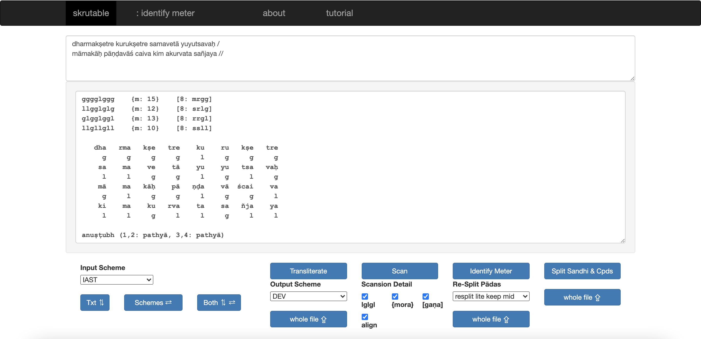

# about

`skrutable` is a toolkit and online workbench providing 
transliteration, scansion, and meter identification for Sanskrit text,
as well access to powerful sandhi and compound splitting.

For more context on the project, see [skrutable.info/about](https://www.skrutable.info/about)

# how to use

The online web app at [skrutable.info](https://www.skrutable.info/)
provides easy access to both one-off and whole-file processing.

See [skrutable.info/help](https://www.skrutable.info/help) for more instructions.

For Python programmers, it's also possible to import and use `skrutable` as a library.
Just `pip install skrutable` and you're ready to start.
See [below](#using-the-code) for more info.

Programmers in any language also have the option to query API endpoints.
See [below](#using-the-api) for more info on that.

# transliteration schemes

Sanskrit can be written in many ways. The schemes featured in `skrutable` are:

<table>
    <thead>
        <tr>
            <th>Scheme Type</th>
            <th>Scheme Abbreviation</th>
            <th>Scheme Full Name</th>
            <th>Example</th>
        </tr>
    </thead>
    <tbody>
        <tr>
            <td rowspan=6>Roman</td>
            <td>IAST</td>
            <td>International Alphabet of Sanskrit Transliteration</td>
            <td>saṃskṛtaṃ paṭhāmaḥ</td>
        </tr>
        <tr>
            <td>HK</td>
            <td>Harvard-Kyoto</td>
            <td>saMskRtaM paThAmaH</td>
        </tr>
        <tr>
            <td>SLP</td>
            <td>Sanskrit Library Protocol 1</td>
            <td>saMskftaM paWAmaH</td>
        </tr>
        <tr>
            <td>ITRANS</td>
            <td>Indian Languages Transliteration</td>
            <td>sa.mskRita.m paThaama.h</td>
        </tr>
        <tr>
            <td>VH</td>
            <td>Velthuis</td>
            <td>sa.msk.rta.m pa.Taama.h</td>
        </tr>
        <tr>
            <td>WX</td>
            <td>Scheme developed at IIT Kanpur</td>
            <td>saMskqwaM paTAmaH</td>
        </tr>
        <tr>
            <td rowspan=3>Indic</td>
            <td>DEV</td>
            <td>Devanagari Unicode</td>
            <td>संस्कृतं पठामः</td>
        </tr>
        <tr>
            <td>BENGALI</td>
            <td>Bengali Unicode</td>
            <td>সংস্কৃতং পঠামঃ</td>
        </tr>
        <tr>
            <td>GUJARATI</td>
            <td>Gujarati Unicode</td>
            <td>સંસ્કૃતં પઠામઃ</td>
        </tr>
    </tbody>
</table>

There is also a very lossy “IASTreduced” (e.g., “samskrtam pathamah”) output option which I find sometimes comes in handy. Additional academic schemes not currently featured include CSX (Classical Sanskrit eXtended, e.g. “saüskçtaü paòâmaþ”), REE (by Ronald E. Emmerick, e.g. “saæsk­taæ paèÃma÷”), and the scheme internal to the [DCS](http://www.sanskrit-linguistics.org/dcs/index.php) (by Oliver Hellwig, e.g. “saºskŸtaº paÅåmaµ”). 

More schemes for writing Sanskrit, especially those corresponding to additional Indic scripts, can easily be added to `skrutable` by modifying the code in `phonemes.py` and `scheme_maps.py`. I'm happy to help with this to some extent. Alternatively, for other tools more focused on wider character support, including for other South Asian languages, see [related projects](#related-projects) below.

Note that I use “encoding” here in the sense of UTF-8 (most often as in over and above ASCII) and “script” in the sense of a distinct character set like either the Roman or Devanagari alphabets (latter actually an abugida), and so I don't use either “Roman” or “Unicode” to refer to any of the individual schemes. For more thoughts on such terminology, see [here](http://indology.info/email/members/wujastyk/) and [here](http://sanskritlibrary.org/Sanskrit/pub/lies_sl.pdf).

# scansion and meter identification

For the concepts and traditional conventions in Sanskrit prosody which `skrutable`'s meter functionality is based on, see above all the appendix of V.S. Apte's *Practical Sanskrit-English dictionary*, 1890, pp. 1179ff. ([on Archive](https://archive.org/details/ldpd_7285627_000/page/n1195/mode/2up))

The most important terms in short:
* *laghu* (l) / *guru* (g): metrically light / heavy syllable
* mora: value of 1 for each light syllable and 2 for each heavy syllable
* *gaṇa*: [traditional abbreviation](https://en.wikipedia.org/wiki/Sanskrit_prosody#Ga%E1%B9%87a) — ya ma ta ra ja bha na sa (la ga) — for each [trisyllable (or monosyllable) group](https://en.wikipedia.org/wiki/Foot_(prosody))
* *anuṣṭubh* (also *śloka*): a verse type consisting of 8 syllables (roughly: *akṣaras*) per quarter (or *pāda*) in a partly constrained, partly fluid *laghu-guru* pattern
* *samavṛtta*: a verse type containing four quarters with the same number of syllables in each and generally a rigid pattern of *laghu*s and *guru*s
* *jāti*: a verse type containing four quarters with set patterns of total moraic length

# related projects

There are numerous related projects which users may find preferable to `skrutable` in certain respects (e.g., more script support, different opinions on edge cases, etc.) Here are my recommended highlights.

| Scheme Detection | Transliteration | Scansion & Meter Identification                                                                | Main Author |
| ---| ---|------------------------------------------------------------------------------------------------| ---|
 | ([“detect.py” module](https://github.com/sanskrit/detect.py)) | **[Sanscript](http://learnsanskrit.org/tools/sanscript)** (also via PyPi [here](https://github.com/sanskrit-coders/indic_transliteration)) | (n/a)                                                                                          | Arun K. Prasad (et al.?) |
 | (n/a) | **[Aksharamukha](http://aksharamukha.appspot.com/converter)** | (n/a)                                                                                          | Vinodh Rajan | 
 | (n/a) | **[Transliteration Tool](https://www.ashtangayoga.info/philosophy/sanskrit-and-devanagari/transliteration-tool/)** | (n/a)                                                                                          | AshtangaYoga.info | 
 | (n/a) | **[Sanscription](http://www.tyfen.com/sanscription/)** | (n/a)                                                                                          | Marc Tiefenauer |
 | ([“detect.py” module](https://github.com/shreevatsa/sanskrit/blob/master/transliteration/detect.py)) | ([“transliteration” subpackage](https://github.com/shreevatsa/sanskrit/tree/master/transliteration)) | **[Metre Identifier](http://sanskritmetres.appspot.com/)**                                     | Shreevatsa Rajagopalan | 
 | (n/a) | (n/a) | **[Meter Identifying Tool](http://sanskritlibrary.org:8080/MeterIdentification/)**             | Keshav Melnad | 
 | (n/a) | (n/a) | **[Chandojñānam](https://sanskrit.iitk.ac.in/jnanasangraha/chanda/)** | Hrishikesh Terdalkar | 

# encoding normalization

Some schemes have internal options. For example, at the level of encoding, IAST is sometimes represented in UTF-8 with combining diacritics, sometimes with precomposed combinations. Alternatively, at the level of the scheme itself, ITRANS writes vocalic r (ṛ, ऋ) as 'Ri', 'RRi', or 'R^i. Because `skrutable` transliterates by way of SLP, and because it must output a single option, you can use round-trip transliteration (e.g., IAST-IAST) to normalize such variation. For example:

~~~
"rāmaḥ" == 'r' + 'a' + '¯' (U+0304) + 'm' + 'a' + 'h' + '.' (U+0323)
>>
"rāmaḥ" == 'r' + 'ā' (U+0101) + 'm' + 'a' + 'ḥ' (U+1E25)
~~~

That is, `skrutable` currently favors precomposed characters for IAST. In the code, these and other scheme-internal defaults can be inspected and changed in `scheme_maps.py`.

# virāma avoidance

For the purpose of printing Indic scripts, it's often aesthetically (if not always scientifically) preferable to remove certain inter-word spaces and their corresponding virāmas, and to instead use ligatures. For example:

~~~
asty eva >> ( अस्त्य् एव ) >> अस्त्येव
~~~

This is the default behavior for transliterating to Indic scripts in `skrutable`. In the code, the regular expressions governing this can be found in `virAma_avoidance.py`, and the overall setting can be toggled with the `avoid_virama_*` parameters to the `transliterate` method.

# sandhi and compound splitting

For splitting Sanskrit text into its individual words, `skrutable` provides a wrapper, accessible through its online interface and the importable library, for applying pre-trained models while also (bonus!) preserving original sentence length and punctuation. For both model options, the wrapper communicates with separate online servers ([my own splitter_server serving the 2018 model](https://splitter-server-tylergneill.pythonanywhere.com/) and https://dharmamitra.org), so you'll need a working internet connection for this functionality.

# using the code

## installation

1. Have Python 3 installed (`Homebrew` or `pyenv`, Python 3.8+, and a virtual environment recommended)

2. Run `pip install skrutable` ([latest version on PyPi](https://pypi.org/project/skrutable/))

## objects

From each respective Python module (`transliteration.py`, `scansion.py`, `meter_identification.py`, `splitting.py`), import the respective object constructor (`Transliterator`, `Scanner`, `MeterIdentifier`, `Splitter`), instantiate the object, and call its primary methods (`transliterate()`, `scan()`, `identify_meter()`, `split()`). Transliteration and sandhi/compound splitting both return strings, whereas scansion and meter identification return `Scansion.Verse` objects, which themselves contain (among other things) a `meter_label` string attribute and a `summarize()` method that returns a string.

The following are the important function parameters:

* transliteration: `from_scheme` and `to_scheme` (`IAST`, `HK`, `SLP`, `ITRANS`, `VH`, `WX`, `IASTreduced`, `DEV`, `BENGALI`, `GUJARATI`), `avoid_virama_indic_scripts` and  `avoid_virama_non_indic_scripts` (`True`, `False`)
* scansion: `show_weights`, `show_morae`, `show_gaRas`, `show_alignment` (`True`, `False`)
* meter identification: `resplit_option` (`none`, `resplit_lite`, `resplit_max`), `keep_mid` (`True`, `False`)
* sandhi/compound splitting: `splitter_model` (`dharmamitra_2024_sept`, `splitter_2018`), `preserve_punctuation` (`True`, `False`), `preserve_compound_hyphens` (`True`, `False`)

Examples:

~~~
input_string = "tava karakamalasthāṃ sphāṭikīmakṣamālāṃ , nakhakiraṇavibhinnāṃ dāḍimībījabuddhyā | pratikalamanukarṣanyena kīro niṣiddhaḥ , sa bhavatu mama bhūtyai vāṇi te mandahāsaḥ ||"
~~~

1. `skrutable.transliteration`, `transliteration.Transliterator`, `Transliterator.transliterate()`
~~~
from skrutable.transliteration import Transliterator
T = Transliterator(to_scheme='DEV')  # using built-in default from_scheme IAST but passing in a default to_scheme 
string_result_1 = T.transliterate( input_string )  # from_scheme=IAST, to_scheme=DEV
string_result_2 = T.transliterate( input_string, to_scheme='BENGALI')  # overriding to_scheme
string_result_3 = T.transliterate( input_string, avoid_virama_indic_scripts=False)  # output Devanāgarī with Roman-like spacing
~~~

2. `skrutable.scansion`, `scansion.Scanner`, `Scanner.scan()`
~~~
from skrutable.scansion import Scanner
S = Scanner()  # has default IAST from_scheme and "show" options True
Verse_result_1 = S.scan( input_string )  # using all defaults 
print( Verse_result_1.summarize(show_label=False) )  # not showing empty label makes more sense 
print( Verse_result_1.summarize(show_alignment=False, show_label=False) )  # can also toggle other things 
Verse_result_2 = S.scan( input_string, from_scheme='DEV')  # can also specify different input scheme here if needed 
~~~

3. `skrutable.meter_identification`, `meter_identification.MeterIdentifier`, `MeterIdentifier.identify_meter()`
~~~
from skrutable.meter_identification import MeterIdentifier
MI = MeterIdentifier()
Verse_result_1 = MI.identify_meter(input_string)  # default from_scheme and resplit_option
print( Verse_result_1.meter_label )
print( Verse_result_1.summarize() )
Verse_result_2 = MI.identify_meter(input_string, resplit_option='none')  # can change way pāda resplitting is done
Verse_result_3 = MI.identify_meter(input_string, from_scheme='DEV', resplit_option='resplit_lite')  # scheme options possible here too
~~~

4. `skrutable.splitting`, `splitting.Splitter`, `Splitter.split()`
~~~
from skrutable.splitting import Splitter
Spl = Splitter()
# this needs an internet connection to connect to the API server
string_result_1 = Spl.split( input_string )  # default splitter-model and punctuation settings
string_result_2 = Spl.split( input_string, preserve_punctuation=False )  # discard punctuation
string_result_3 = Spl.split( input_string, preserve_compound_hyphens=False )  # discard hyphens used to represent compounds
string_result_4 = Spl.split( input_string, splitter_model='splitter_2018')  # use older model
~~~

More examples of how to use the library can be found in the repo's `tests` folder (for use with `pytest`) and in the `jupyter_notebooks` folder.

## using the API

As an alternative to using the Python library, 
you can also access the same four functionalities described above 
by querying the `skrutable` server over the internet.
This Application Programming Interface (API)
has four endpoints, one for each functionality, 
and each with the same set of options that the library offers.
You can use cURL, a Python library, or numerous other methods for making these queries.
Latency for small queries should be under 2 seconds
(first attempts may be slow; the server occasionally needs to be woken up).

See [skrutable.info/api](https://www.skrutable.info/api)
for more specific instructions.

# feedback

Whatever's on your mind, get in touch!
My name is Tyler 
([Academia](https://uni-leipzig1.academia.edu/TylerNeill),
[LinkedIn](https://www.linkedin.com/in/tyler-g-neill/))
and my Gmail is tyler.g.neill. 